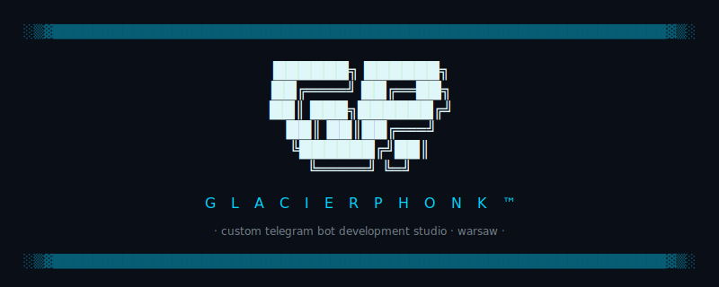

<picture>
  <source media="(prefers-color-scheme: dark)" srcset="assets/header-dark.svg">
  <source media="(prefers-color-scheme: light)" srcset="assets/header-light.svg">
  
</picture>

---

### Services

**Custom Telegram Bots** — Payments, AI integration, notifications, admin controls. Every bot is a standalone TypeScript application with its own database and deployment pipeline.

**Telegram Mini Apps** — Full web interfaces inside Telegram. Storefronts, dashboards, booking systems. Automatic user authentication, no app store friction.

**Channel Automation** — Content channels that run on autopilot. Multi-source aggregation, AI-powered enrichment, scheduled publishing. Nothing posts without AI processing.

[See all services →](https://glacierphonk.com/services/)

### Portfolio

| Project | Type | What it does |
|---------|------|-------------|
| [**FridgeKit**](https://fridgekit.com) | bot + mini app | Kitchen inventory with receipt OCR (Claude Vision), Stars payments, 3-container microservices |
| [**WP Jobs**](https://t.me/WordPressJobsPP) | channel | WordPress job aggregator — 24+ sources, AI-classified listings, 200+ subscribers |
| [**WordPress Pulse**](https://t.me/WordPressPulse) | channel | WordPress ecosystem news — 15 RSS sources, AI summaries, daily automation |
| [**Automation News**](https://t.me/AutomationNewsCh) | channel | Cross-niche automation coverage with AI-enriched content pipeline |
| [**TillerDad**](https://tillerdad.com) | channel | AI-generated parenting content with 60-day topic tracking |

### Stack

`TypeScript` · `grammY` · `Telegram Bot API` · `Telegram Stars` · `Claude AI` · `Docker` · `SQLite` · `GitHub Actions` · `EC2`

### How it works

**Talk** — describe your project, timeline, budget.
**Scope** — we define the spec, timeline, and fixed price.
**Ship** — we build, you review, we deploy. Maintenance available after launch.

Full code ownership. No lock-in.

---

© 2026 GlacierPhonk™ · All rights reserved
